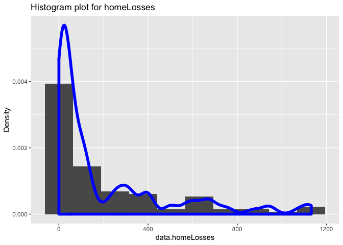

ST558\_Project1
================
Qiaozhi Bao
9/18/2020

  - [Packages Used for Reading JSON
    Data](#packages-used-for-reading-json-data)
      - [httr](#httr)
      - [jsonlite](#jsonlite)
      - [dplyr](#dplyr)
      - [knitr](#knitr)
      - [ggplot2](#ggplot2)
      - [tidyverse](#tidyverse)
      - [devtools](#devtools)
  - [Accessing NHL Data](#accessing-nhl-data)
      - [Creating a Function for Accessing Franchise-team-total
        Data](#creating-a-function-for-accessing-franchise-team-total-data)
      - [Creating a Function for Accessing Franchise-records
        Data](#creating-a-function-for-accessing-franchise-records-data)
      - [Creating a Function for Accessing stats
        Data](#creating-a-function-for-accessing-stats-data)
      - [One-Stop-Shop function](#one-stop-shop-function)
  - [Exploratory Data Analysis](#exploratory-data-analysis)
      - [With active franchises are more likely to win or
        lose?](#with-active-franchises-are-more-likely-to-win-or-lose)
      - [Data Cleaning](#data-cleaning)
      - [The difference that game type and active status generate in
        wins and looses,homewins and roadwins,homelosses and
        roadlosses.](#the-difference-that-game-type-and-active-status-generate-in-wins-and-looseshomewins-and-roadwinshomelosses-and-roadlosses.)

# Packages Used for Reading JSON Data

## httr

## jsonlite

## dplyr

## knitr

## ggplot2

## tidyverse

## devtools

Library list:Below are the libraries we may use

``` r
library(httr)
library(jsonlite)
library(dplyr)
```

    ## 
    ## Attaching package: 'dplyr'

    ## The following objects are masked from 'package:stats':
    ## 
    ##     filter, lag

    ## The following objects are masked from 'package:base':
    ## 
    ##     intersect, setdiff, setequal, union

``` r
library(knitr)
library(ggplot2)
library(tidyverse)
```

    ## ── Attaching packages ──────────────────────────────────────── tidyverse 1.3.0 ──

    ## ✓ tibble  3.0.3     ✓ purrr   0.3.4
    ## ✓ tidyr   1.1.2     ✓ stringr 1.4.0
    ## ✓ readr   1.3.1     ✓ forcats 0.5.0

    ## ── Conflicts ─────────────────────────────────────────── tidyverse_conflicts() ──
    ## x dplyr::filter()  masks stats::filter()
    ## x purrr::flatten() masks jsonlite::flatten()
    ## x dplyr::lag()     masks stats::lag()

``` r
library(devtools)
```

    ## Loading required package: usethis

# Accessing NHL Data

You can find different endpoints in the
[NHL](https://gitlab.com/dword4/nhlapi/-/blob/master/records-api.md)
Records API. There are some functions I created to allow you to access
the data you are interested in with each of the endpoints. The first one
allows you to access the /franchise endpoint using the `get_franchise`
function. \#\# Creating a Function for Accessing Franchise Data

``` r
# The get_franchise will access and get the parses data from /franchise endpoint.
base_url1 <-  "https://records.nhl.com/site/api/franchise"
get_franchise <- function(ID=NULL){
  json1<- GET(base_url1) %>% content("text") %>% fromJSON(flatten = TRUE) %>% as.data.frame() %>% tbl_df()
if(is.null(ID)==FALSE){json<-filter(json1,data.id==ID)}
return(json1)
}
# Test if the function works
get_franchise() # It works well.
```

    ## No encoding supplied: defaulting to UTF-8.

    ## Warning: `tbl_df()` is deprecated as of dplyr 1.0.0.
    ## Please use `tibble::as_tibble()` instead.
    ## This warning is displayed once every 8 hours.
    ## Call `lifecycle::last_warnings()` to see where this warning was generated.

    ## # A tibble: 38 x 7
    ##    data.id data.firstSeaso… data.lastSeason… data.mostRecent… data.teamCommon…
    ##      <int>            <int>            <int>            <int> <chr>           
    ##  1       1         19171918               NA                8 Canadiens       
    ##  2       2         19171918         19171918               41 Wanderers       
    ##  3       3         19171918         19341935               45 Eagles          
    ##  4       4         19191920         19241925               37 Tigers          
    ##  5       5         19171918               NA               10 Maple Leafs     
    ##  6       6         19241925               NA                6 Bruins          
    ##  7       7         19241925         19371938               43 Maroons         
    ##  8       8         19251926         19411942               51 Americans       
    ##  9       9         19251926         19301931               39 Quakers         
    ## 10      10         19261927               NA                3 Rangers         
    ## # … with 28 more rows, and 2 more variables: data.teamPlaceName <chr>,
    ## #   total <int>

## Creating a Function for Accessing Franchise-team-total Data

``` r
#  a function here to get the franchise-team-totals data sets by specifying any id number
base_url_total<- "https://records.nhl.com/site/api/franchise-team-totals"
get_data_totals <- function(ID=NULL){
json<- GET(base_url_total) %>% content("text") %>% fromJSON(flatten = TRUE) %>% as.data.frame() 
if(is.null(ID)==FALSE){json<-filter(json,data.franchiseId==ID)}
return(tbl_df(json))
}
# Test if the function works
get_data_totals()# It works well.
```

    ## No encoding supplied: defaulting to UTF-8.

    ## # A tibble: 105 x 31
    ##    data.id data.activeFran… data.firstSeaso… data.franchiseId data.gameTypeId
    ##      <int>            <int>            <int>            <int>           <int>
    ##  1       1                1         19821983               23               2
    ##  2       2                1         19821983               23               3
    ##  3       3                1         19721973               22               2
    ##  4       4                1         19721973               22               3
    ##  5       5                1         19261927               10               2
    ##  6       6                1         19261927               10               3
    ##  7       7                1         19671968               16               3
    ##  8       8                1         19671968               16               2
    ##  9       9                1         19671968               17               2
    ## 10      10                1         19671968               17               3
    ## # … with 95 more rows, and 26 more variables: data.gamesPlayed <int>,
    ## #   data.goalsAgainst <int>, data.goalsFor <int>, data.homeLosses <int>,
    ## #   data.homeOvertimeLosses <int>, data.homeTies <int>, data.homeWins <int>,
    ## #   data.lastSeasonId <int>, data.losses <int>, data.overtimeLosses <int>,
    ## #   data.penaltyMinutes <int>, data.pointPctg <dbl>, data.points <int>,
    ## #   data.roadLosses <int>, data.roadOvertimeLosses <int>, data.roadTies <int>,
    ## #   data.roadWins <int>, data.shootoutLosses <int>, data.shootoutWins <int>,
    ## #   data.shutouts <int>, data.teamId <int>, data.teamName <chr>,
    ## #   data.ties <int>, data.triCode <chr>, data.wins <int>, total <int>

## Creating a Function for Accessing Franchise-records Data

For this function you have the option to input franchiseName or
franchiseId,both them can get the data you want.You only need to know
one of them, and this function can convert franchiseName to franchiseId.

``` r
base_url2 <-"https://records.nhl.com/site/api/franchise-"
get_records <- function(modifier,ID){
if(is.numeric(ID)){
full_url2 <- paste0(base_url2,modifier,'=',ID)
son2 <- GET(full_url2) %>% content("text") %>% fromJSON(flatten = TRUE)
json2
  }
   else{
     full_url2 <- paste0(base_url2,modifier)
     json2 <- GET(full_url2) %>% content("text") %>% fromJSON(flatten = TRUE)
     json2 <- filter(json2[[1]],franchiseName==ID)
     json2
   }
}
# Test if the function works
get_records('season-records?cayenneExp=franchiseId','Toronto Maple Leafs')
```

    ## No encoding supplied: defaulting to UTF-8.

    ##   id fewestGoals fewestGoalsAgainst fewestGoalsAgainstSeasons
    ## 1 10         147                131              1953-54 (70)
    ##   fewestGoalsSeasons fewestLosses fewestLossesSeasons fewestPoints
    ## 1       1954-55 (70)           16        1950-51 (70)           48
    ##   fewestPointsSeasons fewestTies fewestTiesSeasons fewestWins
    ## 1        1984-85 (80)          4      1989-90 (80)         20
    ##            fewestWinsSeasons franchiseId       franchiseName homeLossStreak
    ## 1 1981-82 (80), 1984-85 (80)           5 Toronto Maple Leafs              7
    ##         homeLossStreakDates homePointStreak
    ## 1 Nov 11 1984 - Dec 05 1984              18
    ##                                   homePointStreakDates homeWinStreak
    ## 1 Nov 28 1933 - Mar 10 1934, Oct 31 1953 - Jan 23 1954            13
    ##          homeWinStreakDates homeWinlessStreak
    ## 1 Jan 31 2018 - Mar 24 2018                11
    ##                                 homeWinlessStreakDates lossStreak
    ## 1 Dec 19 1987 - Jan 25 1988, Feb 11 2012 - Mar 29 2012         10
    ##             lossStreakDates mostGameGoals           mostGameGoalsDates
    ## 1 Jan 15 1967 - Feb 08 1967            14 Mar 16 1957 - NYR 1 @ TOR 14
    ##   mostGoals mostGoalsAgainst mostGoalsAgainstSeasons mostGoalsSeasons
    ## 1       337              387            1983-84 (80)     1989-90 (80)
    ##   mostLosses mostLossesSeasons mostPenaltyMinutes mostPenaltyMinutesSeasons
    ## 1         52      1984-85 (80)               2419              1989-90 (80)
    ##   mostPoints mostPointsSeasons mostShutouts mostShutoutsSeasons mostTies
    ## 1        105      2017-18 (82)           13        1953-54 (70)       22
    ##   mostTiesSeasons mostWins mostWinsSeasons pointStreak
    ## 1    1954-55 (70)       49    2017-18 (82)          16
    ##            pointStreakDates roadLossStreak       roadLossStreakDates
    ## 1 Nov 22 2003 - Dec 26 2003             11 Feb 20 1988 - Apr 01 1988
    ##   roadPointStreak      roadPointStreakDates roadWinStreak
    ## 1              11 Dec 03 2016 - Jan 25 2017             7
    ##                                                                roadWinStreakDates
    ## 1 Nov 14 1940 - Dec 15 1940, Dec 04 1960 - Jan 05 1961, Jan 29 2003 - Feb 22 2003
    ##   roadWinlessStreak    roadWinlessStreakDates winStreak
    ## 1                18 Oct 06 1982 - Jan 05 1983        10
    ##              winStreakDates winlessStreak        winlessStreakDates
    ## 1 Oct 07 1993 - Oct 28 1993             6 Nov 09 2019 - Nov 19 2019

``` r
#It works well.
```

## Creating a Function for Accessing stats Data

There is an
[NHL](https://gitlab.com/dword4/nhlapi/-/blob/master/stats-api.md) Stats
API. Use the `stats` function (details below) to access data sets you
are interested in. you may need to provide ID or modifier information to
access additional details. The 8 available modifiers are as follows:

``` r
stats<-function(ID=NULL, modifier=NULL){
   if (is.null(ID)){url<-"https://statsapi.web.nhl.com/api/v1/teams"}
     else {url<-paste0("https://statsapi.web.nhl.com/api/v1/teams/",ID)}
   json_stats<-if(is.null(modifier)){url}
         else {paste0(url,modifier)}
   json_stats <- GET(json_stats) %>% content("text") %>% fromJSON(flatten = TRUE)%>%as.data.frame() 
  return(tbl_df(json_stats))
}
# test if the function works
stats(ID=NULL,'?expand=team.roster')# It works well.
```

    ## # A tibble: 31 x 32
    ##    copyright teams.id teams.name teams.link teams.abbreviat… teams.teamName
    ##    <chr>        <int> <chr>      <chr>      <chr>            <chr>         
    ##  1 NHL and …        1 New Jerse… /api/v1/t… NJD              Devils        
    ##  2 NHL and …        2 New York … /api/v1/t… NYI              Islanders     
    ##  3 NHL and …        3 New York … /api/v1/t… NYR              Rangers       
    ##  4 NHL and …        4 Philadelp… /api/v1/t… PHI              Flyers        
    ##  5 NHL and …        5 Pittsburg… /api/v1/t… PIT              Penguins      
    ##  6 NHL and …        6 Boston Br… /api/v1/t… BOS              Bruins        
    ##  7 NHL and …        7 Buffalo S… /api/v1/t… BUF              Sabres        
    ##  8 NHL and …        8 Montréal … /api/v1/t… MTL              Canadiens     
    ##  9 NHL and …        9 Ottawa Se… /api/v1/t… OTT              Senators      
    ## 10 NHL and …       10 Toronto M… /api/v1/t… TOR              Maple Leafs   
    ## # … with 21 more rows, and 26 more variables: teams.locationName <chr>,
    ## #   teams.firstYearOfPlay <chr>, teams.shortName <chr>,
    ## #   teams.officialSiteUrl <chr>, teams.franchiseId <int>, teams.active <lgl>,
    ## #   teams.venue.name <chr>, teams.venue.link <chr>, teams.venue.city <chr>,
    ## #   teams.venue.id <int>, teams.venue.timeZone.id <chr>,
    ## #   teams.venue.timeZone.offset <int>, teams.venue.timeZone.tz <chr>,
    ## #   teams.division.id <int>, teams.division.name <chr>,
    ## #   teams.division.nameShort <chr>, teams.division.link <chr>,
    ## #   teams.division.abbreviation <chr>, teams.conference.id <int>,
    ## #   teams.conference.name <chr>, teams.conference.link <chr>,
    ## #   teams.franchise.franchiseId <int>, teams.franchise.teamName <chr>,
    ## #   teams.franchise.link <chr>, teams.roster.roster <list>,
    ## #   teams.roster.link <chr>

## One-Stop-Shop function

``` r
# one stop shop function
one_stop_shop <- function(endpoint,ID=NULL,modifier=NULL){
   if(is.null(endpoint)){stop("Wrong endpoint")}
  else if(endpoint=='franchise'){get_franchise(ID)}
  else if(endpoint=='franchise-team-totals'){get_data_totals(ID)}
  else if(endpoint=='franchise-'){get_records(modifier,ID)}
  else if(endpoint=='teams' ){stats(ID,modifier)}
  else if(endpoint=='teams/'){stats(ID,modifier)}
}
# checking if one-stop-shop function works.
test_stats<-one_stop_shop('teams')
tese_franchise_totals<-one_stop_shop("franchise-team-totals")
```

    ## No encoding supplied: defaulting to UTF-8.

# Exploratory Data Analysis

## With active franchises are more likely to win or lose?

We want to see if active status and a game type will affect the game
results.Using `mutate` function to create some new variables,and using
`full_join` to join some data sets we are interested with different
endpoints by `franchiseId`.After some data cleaning we make some
plots,like boxplots,scaterplotts,barplots and etc to help us find some
associations.Not too surprisingly,the variables `activefranchise` and
`gametypeid` have some effects on the game results.

``` r
# franchise data
franchise_data <- get_franchise()
```

    ## No encoding supplied: defaulting to UTF-8.

``` r
franchise_data<- franchise_data %>% rename(data.franchiseId=data.id) 
franchise_data
```

    ## # A tibble: 38 x 7
    ##    data.franchiseId data.firstSeaso… data.lastSeason… data.mostRecent…
    ##               <int>            <int>            <int>            <int>
    ##  1                1         19171918               NA                8
    ##  2                2         19171918         19171918               41
    ##  3                3         19171918         19341935               45
    ##  4                4         19191920         19241925               37
    ##  5                5         19171918               NA               10
    ##  6                6         19241925               NA                6
    ##  7                7         19241925         19371938               43
    ##  8                8         19251926         19411942               51
    ##  9                9         19251926         19301931               39
    ## 10               10         19261927               NA                3
    ## # … with 28 more rows, and 3 more variables: data.teamCommonName <chr>,
    ## #   data.teamPlaceName <chr>, total <int>

``` r
# franchise_total data
franchise_total <- get_data_totals() 
```

    ## No encoding supplied: defaulting to UTF-8.

``` r
franchise_total
```

    ## # A tibble: 105 x 31
    ##    data.id data.activeFran… data.firstSeaso… data.franchiseId data.gameTypeId
    ##      <int>            <int>            <int>            <int>           <int>
    ##  1       1                1         19821983               23               2
    ##  2       2                1         19821983               23               3
    ##  3       3                1         19721973               22               2
    ##  4       4                1         19721973               22               3
    ##  5       5                1         19261927               10               2
    ##  6       6                1         19261927               10               3
    ##  7       7                1         19671968               16               3
    ##  8       8                1         19671968               16               2
    ##  9       9                1         19671968               17               2
    ## 10      10                1         19671968               17               3
    ## # … with 95 more rows, and 26 more variables: data.gamesPlayed <int>,
    ## #   data.goalsAgainst <int>, data.goalsFor <int>, data.homeLosses <int>,
    ## #   data.homeOvertimeLosses <int>, data.homeTies <int>, data.homeWins <int>,
    ## #   data.lastSeasonId <int>, data.losses <int>, data.overtimeLosses <int>,
    ## #   data.penaltyMinutes <int>, data.pointPctg <dbl>, data.points <int>,
    ## #   data.roadLosses <int>, data.roadOvertimeLosses <int>, data.roadTies <int>,
    ## #   data.roadWins <int>, data.shootoutLosses <int>, data.shootoutWins <int>,
    ## #   data.shutouts <int>, data.teamId <int>, data.teamName <chr>,
    ## #   data.ties <int>, data.triCode <chr>, data.wins <int>, total <int>

``` r
# Group franchise_total data by franchiseId
franchise_total_1 <- group_by(franchise_total,data.franchiseId) %>%
  summarise(totalhomeLosses=sum(data.homeLosses),
            totalhomeWins=sum(data.homeWins),
            data.activeFranchise =data.activeFranchise,
            data.gameTypeId=data.gameTypeId,
             data.homeLosses=data.homeLosses,
            data.losses=data.losses,
            data.homeWins=data.homeWins,
            data.wins=data.wins,
             data.roadLosses=data.roadLosses,
            data.roadWins=data.roadWins,
           
          )
```

    ## `summarise()` regrouping output by 'data.franchiseId' (override with `.groups` argument)

``` r
# use full_join() to combine the two data sets 
# Create new variables
combined <- full_join(franchise_total_1,franchise_data)%>%
  mutate(HomeWinsPercent = data.homeWins/data.wins) %>%
  mutate( HomeLossesPercent = data.homeLosses/data.losses)%>%
  mutate(RoadWinsPercent = data.roadWins/data.wins) %>%
  mutate( RoadLossesPercent = data.roadLosses/data.losses)
```

    ## Joining, by = "data.franchiseId"

## Data Cleaning

``` r
# change some variables to factor and define their factor levels
combined$data.activeFranchise <- as.factor(combined$data.activeFranchise)
levels(combined$data.activeFranchise) <- list('Active'= 1, 'Non-Active'= 0)
combined$data.gameTypeId <- as.factor(combined$data.gameTypeId)
levels(combined$data.gameTypeId) <- list('Type 2' =2 ,'Type 3'=3)
# using filter() to select the rows with game Type 2 and game Type 3
id_2 <- combined %>% filter(data.gameTypeId =='Type 2')
id_3 <- combined %>% filter(data.gameTypeId =="Type 3")
kable(head(combined),caption = "preview of combined data")
```

| data.franchiseId | totalhomeLosses | totalhomeWins | data.activeFranchise | data.gameTypeId | data.homeLosses | data.losses | data.homeWins | data.wins | data.roadLosses | data.roadWins | data.firstSeasonId | data.lastSeasonId | data.mostRecentTeamId | data.teamCommonName | data.teamPlaceName | total | HomeWinsPercent | HomeLossesPercent | RoadWinsPercent | RoadLossesPercent |
| ---------------: | --------------: | ------------: | :------------------- | :-------------- | --------------: | ----------: | ------------: | --------: | --------------: | ------------: | -----------------: | ----------------: | --------------------: | :------------------ | :----------------- | ----: | --------------: | ----------------: | --------------: | ----------------: |
|                1 |            1001 |          2279 | Active               | Type 3          |             131 |         317 |           254 |       434 |             186 |           180 |           19171918 |                NA |                     8 | Canadiens           | Montréal           |    38 |       0.5852535 |         0.4132492 |       0.4147465 |         0.5867508 |
|                1 |            1001 |          2279 | Active               | Type 2          |             870 |        2281 |          2025 |      3449 |            1411 |          1424 |           19171918 |                NA |                     8 | Canadiens           | Montréal           |    38 |       0.5871267 |         0.3814117 |       0.4128733 |         0.6185883 |
|                2 |               2 |             1 | Non-Active           | Type 2          |               2 |           5 |             1 |         1 |               3 |             0 |           19171918 |          19171918 |                    41 | Wanderers           | Montreal           |    38 |       1.0000000 |         0.4000000 |       0.0000000 |         0.6000000 |
|                3 |             102 |           173 | Non-Active           | Type 3          |               7 |          17 |             6 |        18 |              10 |            12 |           19171918 |          19341935 |                    45 | Eagles              | St. Louis          |    38 |       0.3333333 |         0.4117647 |       0.6666667 |         0.5882353 |
|                3 |             102 |           173 | Non-Active           | Type 2          |              81 |         221 |           160 |       258 |             140 |            98 |           19171918 |          19341935 |                    45 | Eagles              | St. Louis          |    38 |       0.6201550 |         0.3665158 |       0.3798450 |         0.6334842 |
|                3 |             102 |           173 | Non-Active           | Type 2          |              14 |          31 |             7 |        11 |              17 |             4 |           19171918 |          19341935 |                    45 | Eagles              | St. Louis          |    38 |       0.6363636 |         0.4516129 |       0.3636364 |         0.5483871 |

preview of combined data

``` r
kable(table(combined$data.activeFranchise,combined$data.gameTypeId))
```

|            | Type 2 | Type 3 |
| :--------- | -----: | -----: |
| Active     |     44 |     43 |
| Non-Active |     13 |      5 |

## The difference that game type and active status generate in wins and looses,homewins and roadwins,homelosses and roadlosses.

We want to see how different game type affect homewins
roadwins,homelosses and roadlosses.

``` r
# Type 2  wins
# for active franchise
type2_wins <- id_2 %>% select(data.activeFranchise,data.wins, data.homeWins, data.roadWins)%>%
  filter(data.activeFranchise == 'Active') %>%
  summarise(wins=sum(data.wins),
            homewins=sum(data.homeWins),
            roadwins=sum(data.roadWins))
```

    ## Adding missing grouping variables: `data.franchiseId`

    ## `summarise()` ungrouping output (override with `.groups` argument)

``` r
# for non-active franchise
type2_wins_non <- id_2 %>% select(data.activeFranchise,data.wins, data.homeWins, data.roadWins)%>%
  filter(data.activeFranchise == 'Non-Active') %>%
  summarise(wins=sum(data.wins),
            homewins=sum(data.homeWins),
            roadwins=sum(data.roadWins))
```

    ## Adding missing grouping variables: `data.franchiseId`
    ## `summarise()` ungrouping output (override with `.groups` argument)

``` r
table_type2_wins <- data.frame(c('Active','Non-Active'),wins=c(50938,1147),homewins=c(29436,718),roadwins=c(21502,429))
table_type2_wins
```

    ##   c..Active....Non.Active..  wins homewins roadwins
    ## 1                    Active 50938    29436    21502
    ## 2                Non-Active  1147      718      429

``` r
# Type 2  losses
# for active franchise
type2_losses <- id_2 %>% select(data.activeFranchise,data.losses, data.homeLosses, data.roadLosses)%>%
  filter(data.activeFranchise == 'Active') %>%
  summarise(losses=sum(data.losses),
            homelosses=sum(data.homeLosses),
            roadlosses=sum(data.roadLosses))
```

    ## Adding missing grouping variables: `data.franchiseId`

    ## `summarise()` ungrouping output (override with `.groups` argument)

``` r
# for non-active franchise
type2_losses_non <- id_2 %>% select(data.activeFranchise,data.losses, data.homeLosses, data.roadLosses)%>%
  filter(data.activeFranchise == 'Non-Active') %>%
   summarise(losses=sum(data.losses),
            homelosses=sum(data.homeLosses),
            roadlosses=sum(data.roadLosses))
```

    ## Adding missing grouping variables: `data.franchiseId`
    ## `summarise()` ungrouping output (override with `.groups` argument)

``` r
table_type2_lossses <- data.frame(c('Active','Non-Active'),losses=c(45599,1663),homelosses=c(18925,660),roadlosses=c(21502,429))
table_type2_lossses
```

    ##   c..Active....Non.Active.. losses homelosses roadlosses
    ## 1                    Active  45599      18925      21502
    ## 2                Non-Active   1663        660        429

``` r
# Type 3 wins
# for active franchies
type3_wins <- id_3 %>% select(data.activeFranchise,data.wins, data.homeWins, data.roadWins)%>%
  filter(data.activeFranchise == 'Active') %>%
  summarise(wins=sum(data.wins),
            homewins=sum(data.homeWins),
            roadwins=sum(data.roadWins))
```

    ## Adding missing grouping variables: `data.franchiseId`

    ## `summarise()` ungrouping output (override with `.groups` argument)

``` r
# for non-active franchies
type3_wins_non <- id_3 %>% select(data.activeFranchise,data.wins,data.homeWins, data.roadWins)%>%
  filter(data.activeFranchise == 'Non-Active') %>%
  summarise(wins=sum(data.wins),
            homewins=sum(data.homeWins),
            roadwins=sum(data.roadWins))
```

    ## Adding missing grouping variables: `data.franchiseId`
    ## `summarise()` ungrouping output (override with `.groups` argument)

``` r
table_type3_wins <- data.frame(c('Active','Non-Active'),wins=c(4357,58),homewins=c(2505,21),roadwins=c(1870,29))
table_type3_wins
```

    ##   c..Active....Non.Active.. wins homewins roadwins
    ## 1                    Active 4357     2505     1870
    ## 2                Non-Active   58       21       29

``` r
# Type 3  losses
# for active franchise
type3_losses <- id_3 %>% select(data.activeFranchise,data.losses, data.homeLosses, data.roadLosses)%>%
  filter(data.activeFranchise == 'Active') %>%
  summarise(losses=sum(data.losses),
            homelosses=sum(data.homeLosses),
            roadlosses=sum(data.roadLosses))
```

    ## Adding missing grouping variables: `data.franchiseId`

    ## `summarise()` ungrouping output (override with `.groups` argument)

``` r
# for non-active franchise
type3_losses_non <- id_3 %>% select(data.activeFranchise,data.losses, data.homeLosses, data.roadLosses)%>%
  filter(data.activeFranchise == 'Non-Active') %>%
   summarise(losses=sum(data.losses),
            homelosses=sum(data.homeLosses),
            roadlosses=sum(data.roadLosses))
```

    ## Adding missing grouping variables: `data.franchiseId`
    ## `summarise()` ungrouping output (override with `.groups` argument)

``` r
table_type3_losses<- data.frame(c('Active','Non-Active'),losses=c(4352,59),homelosses=c(1866,27),roadlosses=c(2486,32))
table_type3_losses
```

    ##   c..Active....Non.Active.. losses homelosses roadlosses
    ## 1                    Active   4352       1866       2486
    ## 2                Non-Active     59         27         32

It appears like active franchise are more likely to win or loose than
Non-active franchise.Active franchise conducts much more wins/looses in
Type 2 games than Type 3 games.Therefore we can make some plots to show
us more directly with the difference that active franchise generates
wins/looses in Type 2 games and Type 3 games in the following steps.
\#\# Plots

``` r
#barplots
# The bar plot show us that active franchise are much more than Non-active franchise
ggplot(combined,aes(x=data.gameTypeId))+
  geom_bar(aes(fill= data.activeFranchise),position='dodge')+ xlab('GameTypeId')+
  ggtitle('Bar plot for Gmae Types')
```

<!-- -->

``` r
ggplot(combined,aes(x=data.activeFranchise))+
  geom_bar(aes(fill= data.gameTypeId),position='dodge')+xlab('Active/Non-active')+
  ggtitle('Bar plot for Active/Non-active status')
```

<!-- -->

``` r
par(mfrow=c(2,3))
g <- ggplot(combined,aes(x=data.wins,..density..))
g+geom_histogram(bins = 10) +ylab("Density") + geom_density(adjust=0.4,lwd=2,color='pink',outline.type = 'full')+
  ggtitle("Histogram plot for wins")
```

<!-- -->

``` r
g <- ggplot(combined,aes(x=data.homeWins,..density..))
g+geom_histogram(bins = 10) +ylab("Density") + geom_density(adjust=0.4,lwd=2,color='pink',outline.type = 'full')+
   ggtitle("Histogram plot for homeWins")
```

<!-- -->

``` r
g <- ggplot(combined,aes(x=data.roadWins,..density..))
g+geom_histogram(bins = 10) +ylab("Density") + geom_density(adjust=0.4,lwd=2,color='pink',outline.type = 'full')+
   ggtitle("Histogram plot for roadWins")
```

<!-- -->

``` r
g <- ggplot(combined,aes(x=data.losses,..density..))
g+geom_histogram(bins = 10) +ylab("Density") + geom_density(adjust=0.4,lwd=2,color='blue',outline.type = 'full')+
  ggtitle("Histogram plot for losses")
```

<!-- -->

``` r
g <- ggplot(combined,aes(x=data.homeLosses,..density..))
g+geom_histogram(bins = 10) +ylab("Density") + geom_density(adjust=0.4,lwd=2,color='blue',outline.type = 'full')+
   ggtitle("Histogram plot for homeLosses")
```

<!-- -->

``` r
g <- ggplot(combined,aes(x=data.roadLosses,..density..))
g+geom_histogram(bins = 10) +ylab("Density") + geom_density(adjust=0.4,lwd=2,color='blue',outline.type = 'full')+
   ggtitle("Histogram plot for roadLosses")
```

<!-- -->

``` r
# From the following boxplots we can see for active franchise with type 2 game are more likely to have high losses or wins;Active franchise with type 3 games are more likely to have low losses or wins
ggplot(combined,aes(x=data.activeFranchise,y=data.wins)) +
  geom_boxplot(fill='white')+
  geom_jitter(aes(color=data.gameTypeId))+
  ggtitle('Boxplot for wins')
```

<!-- -->

``` r
ggplot(combined,aes(x=data.activeFranchise,y=data.losses)) +
  geom_boxplot(fill='white')+
  geom_jitter(aes(color=data.gameTypeId))+
  ggtitle('Boxplot for losses')
```

<!-- -->

``` r
ggplot(combined,aes(x=data.gameTypeId,y=data.wins)) +
  geom_boxplot(fill='white')+
  geom_jitter(aes(color=data.activeFranchise))+
  ggtitle('Boxplot for wins')
```

<!-- -->

``` r
ggplot(combined,aes(x=data.gameTypeId,y=data.losses)) +
  geom_boxplot(fill='white')+
  geom_jitter(aes(color=data.activeFranchise))+
  ggtitle('Boxplot for losses')
```

<!-- -->

``` r
ggplot(combined,aes(x=data.gameTypeId,y=HomeWinsPercent)) +
  geom_boxplot(fill='white')+
  geom_jitter(aes(color=data.activeFranchise))+
  ggtitle('Boxplot for homewins')
```

    ## Warning: Removed 4 rows containing non-finite values (stat_boxplot).

    ## Warning: Removed 4 rows containing missing values (geom_point).

<!-- -->

``` r
ggplot(combined,aes(x=data.gameTypeId,y=HomeLossesPercent)) +
  geom_boxplot(fill='white')+
  geom_jitter(aes(color=data.activeFranchise))+
  ggtitle('Boxplot for homelosses')
```

<!-- -->

``` r
ggplot(combined,aes(x=data.gameTypeId,y=RoadWinsPercent)) +
  geom_boxplot(fill='white')+
  geom_jitter(aes(color=data.activeFranchise))+
  ggtitle('Boxplot for roadwins')
```

    ## Warning: Removed 4 rows containing non-finite values (stat_boxplot).
    
    ## Warning: Removed 4 rows containing missing values (geom_point).

<!-- -->

``` r
ggplot(combined,aes(x=data.gameTypeId,y=RoadLossesPercent)) +
  geom_boxplot(fill='white')+
  geom_jitter(aes(color=data.activeFranchise))+
  ggtitle('Boxplot for roadlosses')
```

<!-- --> The
four plots show that type 3 game accounts less roadlosses percentage and
more homelosses percentage.

``` r
# The two scatterplots show us usually high wins associated with high losses
# Active/Type 2 accounts more wins and losses
ggplot(combined,aes(x=data.wins,y=data.losses,group=data.gameTypeId)) +
  geom_jitter(aes(color=data.gameTypeId)) +
  geom_smooth(method='lm',col='blue')+
  ggtitle("wins & losses")
```

    ## `geom_smooth()` using formula 'y ~ x'

<!-- -->

``` r
ggplot(combined,aes(x=data.wins,y=data.losses,group=data.activeFranchise)) +
  geom_jitter(aes(color=data.activeFranchise)) +
  geom_smooth(method='lm',col='green')+
  ggtitle("wins & losses")
```

    ## `geom_smooth()` using formula 'y ~ x'

<!-- -->

``` r
ggplot(combined,aes(x=data.homeWins,y=data.homeLosses,group=data.gameTypeId)) +
  geom_jitter(aes(color=data.gameTypeId)) +
  geom_smooth(method='lm',col='blue')+
  ggtitle("homewins & homelosses")
```

    ## `geom_smooth()` using formula 'y ~ x'

<!-- -->

``` r
ggplot(combined,aes(x=data.roadWins,y=data.roadLosses,group=data.gameTypeId)) +
  geom_jitter(aes(color=data.gameTypeId)) +
  geom_smooth(method='lm',col='blue')+
  ggtitle("roadwins & roadlosses")
```

    ## `geom_smooth()` using formula 'y ~ x'

<!-- -->

We actually got the consistent conclusion from the above
barplots,histogram plots,boxplots and scatterplots with before.Active
franchise with game type 2 are more likely to have high wins or
looses,usually high wins are associated with high losses,but the overall
wins are a slightly more than overall losses.

From the four scatterplots,it looks like the activefranchise and
gametypeid have consistent effect on
`wins/losses`,`homeWins/roadWins`,`homeLooses/roadLooses`.
